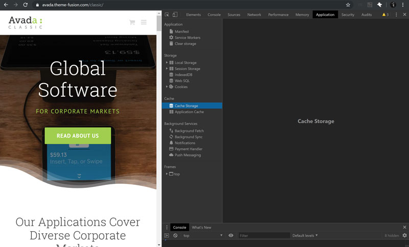

# ini bali : this is bali Progressive Web AMP (Story)

Iya, you read that right. an AMP Story running as a PWA. sick.

"Ini Bali" means "this is Bali". AMP means mobile first. AMP Story means Snapchat/IG style story. PWA means more control over browser caching and can run offline if needed.

---

[live version](https://inibali.netlify.com/)

---

[based on the Build a Progressive Web AMP code lab](https://codelabs.developers.google.com/codelabs/amp-pwa-workbox/#0)

---

## Give it a Try

1. Bring up the [ini bali Progressive Web App AMP story](https://inibali.netlify.com/)
 in your fave browser, then kill your network connection. Reload the page.
2. Bring up _ini bali_ using Google **Chrome** on your desktop or laptop. When you see the `+` icon in your address bar, click it to install on your desktop. Try running ini bali with and without internet.
3. Bring up _ini bali_ on **Safari** on you iPhone. Press the share icon. Swipe up and press on **Add to Home Screen**. Run the app with and without internet on your iPhone.

---

## About AMP and PWA

[Accelerated Mobile Page by Google and Twitter](https://amp.dev/)

[Progressive Web Apps by Google](https://developers.google.com/web/progressive-web-apps)

---

## Screen Grabs

### Installing ini bali via Safari on iOS

---

### Browser Caching Benchmarks

Click on image for larger version, if available. Then, click the `Download` button to view the full size.

#### No Browser Caching Going On

  No HTTP browser caching. If there were, we would see some zero load times and see some _from cache_ messages in the _size_ column.

---

  Obviously, no application caching (not a PWA).

---

HTTP browser caching enabled. We can see some zero load times and see some _memory cache_ messages in the _size_ column. Zero load times are _sweet_.

---

  Pre-caching static files. Definitely a PWA.

---

  Runtime (dynamic) caching. Definitely a PWA.

---

### Performance Benchmarks

Pretty _stoked_ with these initial results. This is out of the box with no performance tuning save standard image scaling and compression.

<em>Edit 13 November 2019: Now getting a 90 on mobile and 100 on desktop. This is after further scaling the four images for the collage page, yet adding one new story page. I'll take it!</em>

  Initial Google PageSpeed Insights Mobile

---

  Initial Google PageSpeed Insights Desktop
  
---

  Google PageSpeed Insights Mobile After More Image Optimisation but Adding One New Page

---

  Google PageSpeed Insights Desktop After More Image Optimisation but Adding One New Page
  
---

Want to support my work? [Shameless Plug to Help Our Millie](https://ko-fi.com/marklchaves)
